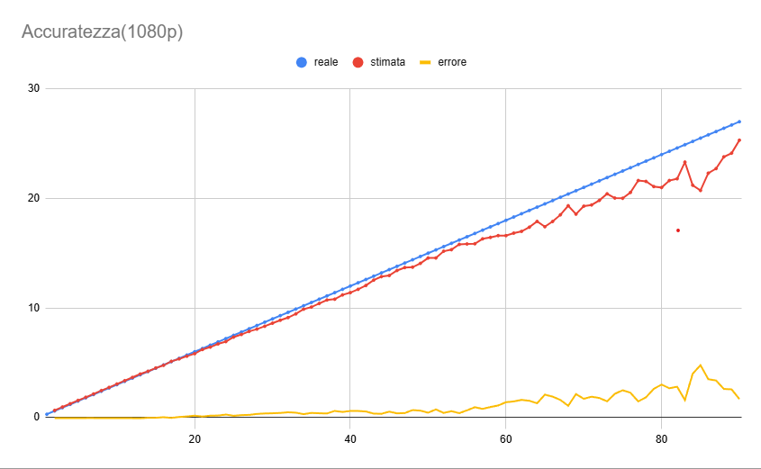
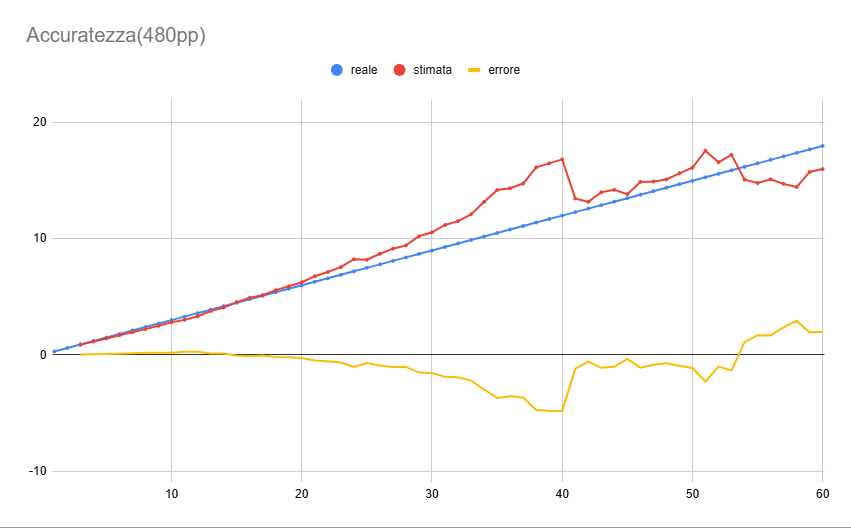

# Detection System Accuracy

In the graph below, the detection system's accuracy is illustrated.  
The blue line represents the correct (real) value,  
the red line shows the value estimated using stereo cameras,  
and the yellow line indicates the estimation error.  
All values are expressed in meters.

As in the previous graph, the same color scheme is used:  
blue for the real value, red for the stereo camera estimation, and yellow for the estimation error.  
It can be observed that in the 480p graph, the accuracy is lower compared to the 1080p graph at the same distances.

